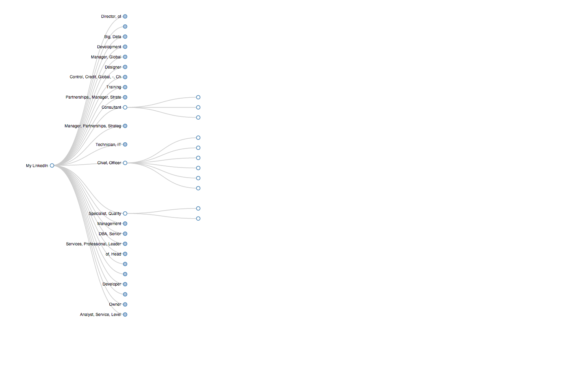

#LinkedIn Connections Collapsible Tree

###Usage

Create your own LinkedIn Connections Collapsible Tree using the ```generate_json.py``` script.

* Download the connections export csv file in ```Outlook``` format [here](http://www.linkedin.com/people/export-settings) and place it in the current folder. The file should be named  ```linkedin_connections_export_microsoft_outlook.csv```

*  Run ```python generate_json.py```

* Fire up a web server in order to view and interact with the graph e.g. ```python -m SimpleHTTPServer [port number]```

* ```index.html``` will display the graph and read data from ```flare.json```

###Requirements

* **Python Libraries**:
  - NLTK
  - csv
  - cluster


* **LinkedIn Connections CSV File**
  - Download the connections export in ```Outlook``` format [here](http://www.linkedin.com/people/export-settings) and place it in the current folder

### Anonymized Example

***By clicking on the nodes you can expand to the children***



#COPYRIGHT

These scripts are dedicated to the public domain. Use them as you please with no restrictions whatsoever.

Contributions are greatly appreciated. Please fork this repository and open a pull request.

The code in this repository has been inspired and readapted from [Mike Bostock's Collapsible Tree, An interactive version of a Reingold–Tilford tree](http://bl.ocks.org/mbostock/4339083) and [Matthew A. Russell's Mining the Social Web, 2nd Edition (O'Reilly, 2013)](
http://bit.ly/135dHfs).
